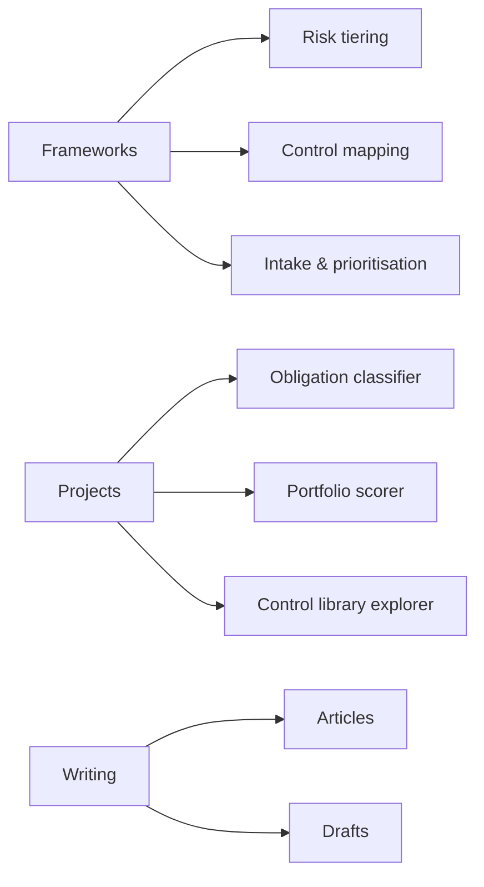

<!-- Banner should be 1280×640. Degrades gracefully if the file is absent. -->

  

# AI Governance Portfolio

**Frameworks, tools and writing on governing AI in practice — with a GCC lens.**

Practical artefacts for the people accountable for AI in an organisation: risk
tiering, control mapping across overlapping regulations, use case intake and
prioritisation, and the delivery scaffolding that keeps governance attached to
execution rather than bolted on afterwards.

<!-- TODO: add certification badges once confirmed — AIGP, Databricks Azure Platform Architect,
     AWS Cloud Practitioner. Do not render unverified certification badges. -->

## Who this is for

- AI and data leaders standing up a governance function
- PMO and transformation leads embedding governance into delivery
- Public sector teams working across EU, GCC and international frameworks simultaneously
- Practitioners preparing for AI governance certification

## What's in here

**Frameworks** — reusable templates and models for running AI governance day to day.
**Projects** — working tools that put the frameworks into practice.
**Writing** — articles on AI governance in practice, with a GCC lens.

## Frameworks

| Framework | What it does | Status |
| --- | --- | --- |
| [AI Use Case Business Card](frameworks/01-ai-use-case-business-card/) | A single-page artefact carrying a use case from intake to decommissioning — business case, measurement plan and governance record in one card | Published |
| [Use Case Prioritisation Model](frameworks/02-use-case-prioritisation-model/) | Three-axis scoring — value, feasibility, and cost of control — with Monte Carlo stability-tested bands instead of a false-precision rank | Published |
| [Model Risk Tiering](frameworks/03-model-risk-tiering/) | [TODO] | Draft |
| [Cross-Regulation Control Library](frameworks/04-cross-regulation-control-library/) | [TODO] | Draft |
| [AI Project PMO Toolkit](frameworks/05-ai-project-pmo-toolkit/) | [TODO] | Draft |
| [AI System Register Schema](frameworks/06-ai-system-register-schema/) | [TODO] | Draft |
| [FRIA and DPIA Templates](frameworks/07-fria-and-dpia-templates/) | [TODO] | Draft |
| [Model Card Template](frameworks/08-model-card-template/) | [TODO] | Draft |
| [Vendor AI Due Diligence](frameworks/09-vendor-ai-due-diligence/) | [TODO] | Draft |
| [Incident Taxonomy and Reporting](frameworks/10-incident-taxonomy-and-reporting/) | [TODO] | Draft |
| [Governance Operating Model](frameworks/11-governance-operating-model/) | [TODO] | Draft |
| [Governance Maturity Assessment](frameworks/12-governance-maturity-assessment/) | [TODO] | Draft |

## Projects

| Project | What it does | Stack | Status |
| --- | --- | --- | --- |
| [EU AI Act Obligation Classifier](projects/01-eu-ai-act-obligation-classifier/) | [TODO] | [TODO] | Draft |
| [Use Case Portfolio Scorer](projects/02-use-case-portfolio-scorer/) | [TODO] | [TODO] | Draft |
| [Control Library Explorer](projects/03-control-library-explorer/) | [TODO] | [TODO] | Draft |

## Writing

Articles on AI governance in practice, with a GCC lens. See [writing/](writing/) for the full index.

## About

Cédric Faure is a Data & AI leader based in Abu Dhabi, working across AI
governance, strategy and delivery for government, healthcare and energy
organisations in the GCC. Fourteen years spanning strategy consulting,
solution delivery and regulatory alignment — currently focused on how
organisations adopt AI in a way that is rational, secure, ethical, compliant
and sustainable.

[LinkedIn]([TODO: LinkedIn URL])

## Provenance and disclaimer

This repository is independent personal work, unrelated to any current or
former employer or client engagement. All data used in examples and projects
is synthetic or drawn from public sources. Frameworks and templates are
provided for general reference and do not constitute legal, regulatory, or
compliance advice. See [DISCLAIMER.md](DISCLAIMER.md) for the full statement.

## Licence

Code is licensed under [MIT](LICENCE-CODE.md); written content is licensed under [CC BY 4.0](LICENCE-CONTENT.md).
