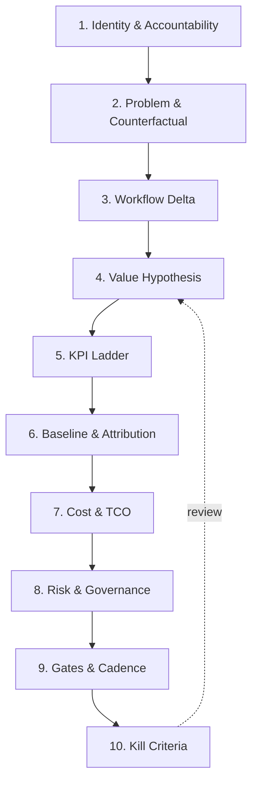

# AI Use Case Business Card

One page that carries a use case from intake to decommissioning — business case, measurement plan and governance record in a single artefact.

## Purpose

The AI Use Case Business Card is a **single-page artefact created at intake** that carries a use case through its entire life, from idea to decommissioning. It merges three documents that organisations normally keep apart and reconcile too late:

- the **business case** (why this is worth funding),
- the **measurement plan** (how we will know it worked), and
- the **governance record** (what risk this carries and who is accountable).

Keeping these separate is the root of a common failure: a use case is approved on projected value, built without a baseline, deployed without an owner, and then defended with numbers nobody can attribute. The Business Card exists to make that sequence structurally impossible.

**Design principle:** *If the card cannot be completed honestly, the use case is not ready to be funded.* Blank fields are the output, not a failure of the process.

## Who this is for

| Role | What they get from it |
|---|---|
| Business sponsor | A defensible case with an explicit confidence grade, not a point estimate they will be held to |
| AI / data leader | A portfolio of comparable cards that can be ranked, sequenced and killed on evidence |
| Finance / investment committee | Benefits and full TCO in one ledger, with a stated rule for how much benefit may enter the plan |
| Risk, compliance, legal | Risk classification captured at intake rather than retrofitted before go-live |
| PMO / delivery lead | Gate criteria and kill criteria agreed before build starts, not negotiated under pressure |

## Why the card is shaped this way

Six findings from the research base drive the design. Each maps to a specific field on the card.

**1. Workflow redesign, not model choice, predicts financial impact.** Organisations seeing material returns are consistently those that redesigned the end-to-end workflow before deploying, rather than layering AI onto an existing process. → *Drives Section 3 of the card: the before/after workflow delta is mandatory and is the first substantive field.*

**2. Adoption is the most common point of failure.** Capable systems produce nothing if they are not used in the real workflow. Downstream operational KPIs do not move without sustained engagement and trust. → *Drives the KPI ladder: adoption metrics are a mandatory gate, not a vanity metric.*

**3. Benefits are heterogeneous and sometimes negative.** The strongest field evidence (customer support, ~5,000 agents, staggered rollout) shows roughly 15% average productivity gain — but concentrated in less experienced workers, with the most skilled seeing small speed gains and small quality declines. A rigorous RCT with experienced open-source developers found a **19% slowdown**, while the same developers believed they had been sped up by ~20%. → *Drives two fields: the mandatory cohort breakdown of expected benefit, and the prohibition on self-reported time savings as a primary KPI.*

**4. Value arrives on a J-curve.** Early adoption typically produces a temporary productivity dip driven by the learning curve, the "verification tax" of reviewing higher volumes of AI output, and downstream pipeline bottlenecks. → *Drives the time-to-value profile field, which requires an explicit dip depth and duration rather than a straight-line ramp.*

**5. AI changes the risk profile in both directions.** It removes some exposures and introduces others (drift, bias liability, adversarial manipulation, regulatory penalty). Ignoring either side produces a wrong number. → *Drives the risk delta field and the risk-adjusted net benefit formula.*

**6. TCO is systematically underestimated.** Post-deployment costs — pipeline maintenance, drift detection, retraining, monitoring, compliance documentation, specialised talent premium — are routinely excluded. Technical debt in ML systems erodes projected returns materially if unserviced. → *Drives the full TCO block, including the mandatory run-cost and reserve lines.*

## The card at a glance

Ten blocks. The card is one page. Anything that does not fit on one page belongs in the annex, not the card.

**1. Identity & accountability** — every owner field is a named person; "the Data Office" is not an owner.

**2. Problem & counterfactual** — what is changing, the volume it occurs at, and whether the avoided cost genuinely arrives.

**3. Workflow delta** — process today vs after, steps removed (not just accelerated), new steps introduced, and where the human decision point sits.

**4. Value hypothesis** — each benefit classified by shape (see [benefit taxonomy](reference/benefit-taxonomy.md)), with its realisation path stated.

**8. Risk & governance** — risk classification, oversight model, affected persons, contestability and data provenance, captured at intake.

**9. Gates & cadence** — four gates (Intake, Pilot, MVP, Scale) plus Sustain/Decommission, each with an evidence requirement and a named decision-maker.

**10. Kill criteria** — the specific, pre-agreed conditions under which the use case stops, declared before anyone is invested in the outcome.

Full field-level detail for every block is in the [template](template/ai-use-case-business-card.md).

## The KPI ladder

Five layers. Every use case declares at least one KPI per layer, each with an owner, a baseline, a target, a threshold and a measurement method. A use case with no Layer 3 KPI is a tool deployment, not a business case.

| Layer | Question it answers | Owner | Example KPIs |
|---|---|---|---|
| **L5 Technical** | Is the system reliable, safe and affordable? | Data science / engineering | Output quality score, hallucination / error rate, p95 latency, cost per interaction, drift indicator |
| **L4 Adoption** | Are people using and trusting it? | Product / frontline ops | Workflow penetration, weekly active eligible users, acceptance rate, override rate |
| **L3 Operational** | Is the work actually getting better? | Named process owner | Cycle time, cost per case, first-contact resolution, rework rate, throughput per FTE |
| **L2 Strategic** | Is business performance shifting? | BU lead / strategy | Customer satisfaction, on-time delivery, retention, compliance performance, service coverage |
| **L1 Financial** | Is enterprise value being created? | Finance / FP&A | Net benefit vs TCO, cost-to-serve, incremental revenue, payback period, risk-adjusted NPV |

**Rule:** L1 and L2 do not move first. Expecting financial signal at pilot stage causes premature termination of good use cases and premature scaling of bad ones. Gate on the layer appropriate to the phase.

Computation methods for every KPI above, plus the non-financial value tiers, are in the [KPI library](reference/kpi-library.md).

## Baselining

Most AI business cases fail here, and it is the single field that most distinguishes a credible card from a plausible one. The card therefore carries an explicit **Baseline Confidence Grade**, and that grade **caps how much projected benefit may be entered into the financial plan.**

| Grade | Method | Description | Benefit booking cap |
|---|---|---|---|
| **A** | System-derived historical data | ≥12 months of transaction-level data from the operational system, covering the exact metric | **100% of P50** |
| **B** | Process mining | Event-log-derived process performance, ≥3 months, covering ≥80% of case volume | **85% of P50** |
| **C** | Time-motion study | Structured observation, 2–4 weeks, statistically sampled across roles, shifts and case types | **70% of P50** |
| **D** | Structured expert elicitation | Three-point (optimistic / likely / pessimistic) estimates from ≥5 independent practitioners, aggregated, with dispersion reported | **50% of P50** |
| **E** | External benchmark only | Industry figures, vendor claims or published studies, with no internal measurement | **0% — indicative only** |

**The hard rule: no use case passes the Build gate at Grade E.** If the baseline does not exist, the first funded activity is establishing it.

The full mitigation ladder for when no baseline exists, attribution designs, prohibited KPIs, and the optimism bias adjustment are in [baseline grading](reference/baseline-grading.md).

## Using it

1. Complete Blocks 1–4 at intake.
2. Declare the baseline confidence grade and attribution design.
3. Agree gates and kill criteria before build starts.
4. Instrument measurement before deployment.
5. Re-run the card annually with actuals replacing projections.

## Reference library

- [KPI library](reference/kpi-library.md) — computation methods for every KPI, plus the non-financial value tiers
- [Baseline grading](reference/baseline-grading.md) — confidence grades, the mitigation ladder, attribution design and the optimism bias adjustment
- [Benefit taxonomy](reference/benefit-taxonomy.md) — the seven benefit shapes and their honesty risks
- [Threshold defaults](reference/threshold-defaults.md) — gate thresholds, cost and planning defaults, and effect-size anchors

## Worked example

A fully synthetic municipal permit-triage case shows the card completed end to end, including a Grade C baseline, a stated J-curve dip, and a marginal P10 case. See [examples/worked-example-permit-triage.md](examples/worked-example-permit-triage.md).

## Limitations

State these plainly; they are a credibility asset, not a weakness.

- The threshold values are calibration defaults synthesised from published research and general practice. They are not derived from a single validated dataset and require local recalibration.
- The benefit booking caps are a **design choice**, not an empirical finding. They are calibrated to be conservative. An organisation with strong measurement maturity may justifiably loosen them; one that has been repeatedly burned should tighten them.
- The risk delta calculation depends on loss-expectancy estimates that are frequently unavailable for novel AI failure modes. The framework's position is that an explicit estimate with declared uncertainty is better than an implicit assumption of zero — but it is still an estimate.
- The framework assumes a use case can be scoped to a bounded workflow with an identifiable process owner. Genuinely cross-cutting capabilities — a shared platform, a foundation-model licence, an enterprise assistant — do not fit this shape and should be appraised as infrastructure, not as a use case.
- Effect sizes cited from published studies are from specific settings and are included for sanity-checking only. They are not transferable estimates.
- The framework does not price option value or strategic learning. Some use cases are worth funding for what the organisation learns, and this card will undervalue them. Where that is the rationale, say so explicitly rather than manufacturing a benefit number.

## References

Cite in this exact form. Do not add entries.

- Brynjolfsson, E., Li, D. and Raymond, L. (2025). *Generative AI at Work*. Quarterly Journal of Economics, 140(2), 889–942.
- Becker, J., Rush, N., Barnes, E. and Rein, D. (2025). *Measuring the Impact of Early-2025 AI on Experienced Open-Source Developer Productivity*. METR.
- Dell'Acqua, F. et al. (2023). *Navigating the Jagged Technological Frontier: Field Experimental Evidence of the Effects of AI on Knowledge Worker Productivity and Quality*. Harvard Business School Working Paper 24-013.
- Noy, S. and Zhang, W. (2023). *Experimental Evidence on the Productivity Effects of Generative Artificial Intelligence*. Science.
- Peng, S. et al. (2023). *The Impact of AI on Developer Productivity: Evidence from GitHub Copilot*.
- Huwyler, H. (2025). *The Risk-Adjusted Intelligence Dividend: A Quantitative Framework for Measuring AI Return on Investment Integrating ISO 42001 and Regulatory Exposure*. arXiv:2511.21975.
- Sculley, D. et al. (2015). *Hidden Technical Debt in Machine Learning Systems*. NeurIPS 28.
- Lorenz, J-T., Abraham, J.C., Levin, R. and Ziman, D. (2026). *From Promise to Impact: How Companies Can Measure — and Realize — the Full Value of AI*. McKinsey QuantumBlack.
- DORA (2026). *ROI of AI-Assisted Software Development*. Google Cloud.
- HM Treasury (2026). *The Green Book: Central Government Guidance on Appraisal and Evaluation*.
- ISO/IEC 42001:2023. *Information Technology — Artificial Intelligence — Management System*.
- NIST (2023). *Artificial Intelligence Risk Management Framework (AI RMF 1.0)*. NIST.AI.100-1.

## Version history

| Version | Date | Change |
|---|---|---|
| 1.0.0 | 2026-08-06 | Initial publication |
