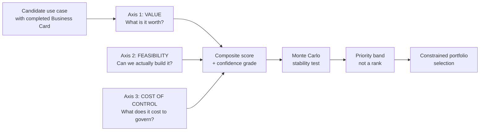

# Use Case Prioritisation Model

Three axes, stability-tested bands instead of ranks, and a portfolio selected under real constraints.

## Purpose

The Use Case Prioritisation Model decides which AI use cases to fund, in what order, and which to refuse — across a portfolio, under real constraints, with an honest account of how much confidence the ranking deserves.

It consumes the [AI Use Case Business Card](../01-ai-use-case-business-card/) (Framework 01). One card per candidate; this model ranks the cards. A candidate with no card is not a candidate.

**The problem it solves.** Most organisations prioritise AI on a value-versus-feasibility 2×2. That model has three defects that reliably produce the wrong portfolio:

1. **It ignores the cost of governing what it selects.** Value and feasibility are assessed; the compliance and control overhead that follows from the use case's risk classification is not. This is not a neutral omission — it is systematically biased, for the reason set out below in "Why cost of control is its own axis".
2. **It produces a ranking the evidence cannot support.** Scores derived from uneven evidence are summed to two decimal places and read as an order. The precision is manufactured.
3. **It outputs a list when the decision is a selection.** Ranking answers "which is best?" The actual question is "which set can we do, given that we have four people who can build this and one committee that can review it?"

**Design principle:** the model must be able to say no. A prioritisation model that ranks everything and excludes nothing has not prioritised. Leading organisations concentrate on materially fewer use cases than their peers and report better returns for it.

## Who this is for

| Role | What they get |
|---|---|
| AI / data leader | A defensible, repeatable selection they can take to an investment committee |
| Investment committee | Comparable candidates, with confidence stated, and an explicit account of what was refused |
| Risk and compliance | Visibility at selection time, not at pre-deployment |
| Business sponsors | A transparent rubric they can prepare against — and cannot game |
| PMO | A sequenced portfolio with dependencies and enabler work made explicit |

## The three axes

Every candidate is scored on three axes. The third is the one most models omit.



### Axis 1 — Value (weight 40%)

| Criterion | Weight within axis | What is being scored |
|---|---|---|
| Risk-adjusted net benefit | 35% | From Business Card Block 4, after booking cap and optimism haircut |
| Strategic fit | 25% | Alignment to a named, current organisational objective |
| Non-monetisable / mission value | 20% | Tier 2 benefits with a stated baseline and target |
| Reusability | 20% | Assets this creates that later use cases consume |

**Rule:** the risk-adjusted net benefit score must use the capped and haircut figure from the Business Card, not the headline projection. A candidate with a Grade E baseline enters this axis at a structural disadvantage, which is correct — we do not know what it is worth.

### Axis 2 — Feasibility (weight 30%)

| Criterion | Weight within axis | What is being scored |
|---|---|---|
| Data readiness | 30% | Does the data exist, is it accessible, is its quality known |
| Technical complexity | 20% | Integration surface, novelty, dependency on unproven capability |
| Workflow change burden | 25% | How much the process and the people must change (see rule below) |
| Sponsorship and capacity | 25% | Named sponsor with authority, and the scarce people are actually available |

**Rule on workflow change burden:** this criterion is scored inversely to the temptation. A use case requiring no workflow change is easy — and, on the evidence, likely to deliver little. Score the burden honestly as a cost, but read a near-zero burden as a warning about Axis 1, not a strength. Overlaying AI on an unchanged process is the dominant failure pattern.

### Axis 3 — Cost of Control (weight 30%, scored as a penalty)

| Criterion | Weight within axis | What is being scored |
|---|---|---|
| Regulatory classification burden | 30% | Obligations arising from the risk tier under each applicable regime |
| Oversight operating cost | 25% | Recurring human review, escalation and appeal handling |
| Assurance and evidence burden | 25% | Documentation, testing, audit, impact assessment, monitoring |
| Residual risk exposure | 20% | Modelled negative risk delta not eliminated by controls |

This axis is subtracted, not added.

## Why cost of control is its own axis

This section is the intellectual core of the framework.

Regulatory risk tiers are assigned on the basis of consequence to people. Systems that influence access to employment, credit, education, essential public services, healthcare, or law enforcement outcomes attract the heaviest obligations — precisely because the decisions they touch matter.

But those are the same decisions that carry the most organisational value. High-consequence decisions are high-volume, high-cost, and high-stakes; automating or augmenting them is where the money is.

The two facts are the same fact. Value and regulatory burden are positively correlated by construction, not by coincidence.

The consequence: a value-versus-feasibility model systematically over-ranks exactly the use cases whose true cost it omits. The error is not random noise that averages out across a portfolio; it is a directional bias concentrated in the candidates the model recommends most strongly. An organisation using a two-axis model will reliably approve its highest-burden use cases while believing it has costed them.

Making control cost a separate, subtracted axis does three things:

1. It corrects the bias at the point of selection rather than at pre-deployment, when the money is already spent.
2. It makes the trade-off visible and arguable rather than implicit — a sponsor can now say "the value survives the burden" and be checked.
3. It reframes governance from a brake into a priced input. A high-burden use case is not forbidden; it must simply clear a higher bar, which is exactly what a rational investor would require.

**On costing this axis in currency.** The framework deliberately scores control cost on a relative 1–5 scale rather than in currency. Published estimates of compliance cost for a single high-risk AI system diverge by more than an order of magnitude — from roughly €10,000 for self-assessed conformity, to €193,000–330,000 for quality management system establishment with substantial annual maintenance, to independent analyses citing $8–15M initial programme cost at large enterprises. These figures measure different things (per-system versus programme-wide, provider versus deployer, marginal versus fully-loaded) and are not reconcilable into a defensible unit cost.

Anyone publishing a single per-system compliance figure is either scoping something narrower than they state or guessing. The honest treatment is a relative burden tier, calibrated against the organisation's own observed cost after its first two or three high-tier systems. Until that internal data exists, use the tier; do not manufacture a number.

See [cost-of-control-rationale.md](reference/cost-of-control-rationale.md) for this section standalone.

## Scoring

```
Value_axis       = Σ (criterion score × within-axis weight)      → 1..5
Feasibility_axis = Σ (criterion score × within-axis weight)      → 1..5
Control_axis     = Σ (criterion score × within-axis weight)      → 1..5

Priority Score = (0.40 × Value) + (0.30 × Feasibility) − (0.30 × Control) + 3.0

Range: 0.5 .. 5.5.  The +3.0 constant keeps the score positive and readable;
it is a presentation device and carries no meaning. State this on the card.
```

**Why Cost of Control is subtracted rather than folded into feasibility.** Governance overhead is not a feasibility problem — a high-risk use case is entirely feasible; it simply costs more to run lawfully and safely. Collapsing the two hides the trade-off the organisation most needs to see: whether the value survives the control cost. Keeping the axis separate also means the portfolio can be reported by control burden, which is what a risk committee will ask for.

Scoring is done by a cross-functional panel, not by the sponsor. The full anchored, five-point rubric for all twelve criteria is in [template/scoring-rubric.md](template/scoring-rubric.md) — print it, it is the working document a panel uses in the room.

## Score confidence

A score of 4 supported by production data and a score of 4 supported by a sponsor's assertion are not the same claim. The model records both.

Every criterion carries an evidence grade, using the same scheme as the Business Card baseline grades:

| Grade | Evidence behind the score |
|---|---|
| A | System-derived data or completed assessment |
| B | Process-mined or documented analysis |
| C | Structured study or formal review |
| D | Structured expert elicitation, ≥3 independent assessors, dispersion recorded |
| E | Single assertion, vendor claim, or external benchmark only |

Portfolio Confidence Index = mean evidence grade across all scored criteria, mapped A=5 … E=1.

**Rules:**

- A candidate whose Value axis is graded predominantly D–E cannot be selected for build. It can be selected for a discovery sprint whose only deliverable is better evidence.
- Report the confidence index alongside every ranking. A portfolio ranked on Grade D evidence is a hypothesis, and presenting it as a decision is the error the model exists to prevent.
- Evidence grade is scored by the panel, not the sponsor.

## Rank stability

**The problem.** Multi-criteria scoring models are vulnerable to rank reversal: the relative order of two alternatives can change when an unrelated alternative is added to or removed from the candidate set. This is a violation of independence of irrelevant alternatives, demonstrated in the Analytic Hierarchy Process in 1983 and argued over ever since. An AI use case portfolio has candidates added and dropped every cycle. Any hard ranking it produces is partly an artefact of which candidates happened to be in the room.

Combined with uncertain scores and arbitrary-to-two-decimal-places weights, a ranked list from this class of model conveys far more precision than it holds.

**The treatment. Do not publish a rank. Publish a stability-tested band.**

- **P(top quartile) > 0.75** → robustly prioritised. Fund it.
- **0.25 – 0.75** → genuinely contested. The model cannot separate these; the decision is a judgement call and should be made and minuted as one.
- **< 0.25** → robustly deprioritised. Say no, and say why.

This is the framework's central honesty claim. A model that outputs "ranked 4th" when the underlying evidence supports "somewhere between 2nd and 11th" is not being rigorous; it is laundering uncertainty into false authority. Banding is less satisfying and more true. Expect resistance from stakeholders who wanted a number, and hold the line — the credibility of the whole process depends on it.

Full Monte Carlo procedure, including the distribution widths by evidence grade and the weight-uncertainty treatment, is in [reference/rank-stability.md](reference/rank-stability.md).

## From ranking to selection

A ranked list is not a plan. Selection must respect real constraints, and the binding constraint is almost never money — scarce specialist capacity, governance review throughput, change absorption, data engineering capacity, and executive attention are all more commonly binding.

Declare constraints numerically, remove candidates blocked by unmet dependencies, reserve the minimum enabler allocation, select greedily by median composite score until the binding constraint is exhausted, test the shape of the result, and adjust only by explicit, minuted exception. Full procedure, including why the framework deliberately does not solve this as the knapsack problem it formally is, is in [reference/portfolio-selection.md](reference/portfolio-selection.md).

## Portfolio shape

The selection is tested against shape, not only score. Suggested defaults, to be set locally:

| Dimension | Default target | Rationale |
|---|---|---|
| Number of active use cases | Fewer than instinct suggests | Concentration outperforms breadth; leading organisations run materially fewer than their peers and report better returns |
| Enabler allocation | ≥20% of capacity | Foundations lose every scoring contest without a floor |
| Control-burden mix | No more than one-third of capacity in the highest control tier | High-tier use cases consume governance throughput disproportionately |
| Time-to-value mix | At least one candidate with a credible result inside two quarters | Programme survival depends on demonstrated value before the first budget review |
| Confidence mix | Majority of build-stage capacity at Grade C or better | Otherwise the portfolio is a set of hypotheses |
| Sponsor concentration | No single sponsor holding a majority of capacity | Prevents the portfolio becoming one executive's agenda |

## Using it

1. Gather completed Business Cards for every candidate.
2. Convene the panel — sponsor presents, then withdraws from scoring (see [reference/anti-gaming.md](reference/anti-gaming.md) for the full set of provisions that keep this trustworthy).
3. Score every criterion against the anchored rubric, with an evidence grade.
4. Run the stability test against the scored portfolio.
5. Select under declared, numeric constraints.
6. Test the shape of the resulting portfolio and minute any exceptions.

## The tool

`tool/score.py` runs the deterministic scoring, the dependency-adjusted value for enablers, and the Monte Carlo stability test against a portfolio register CSV, and prints the bands and validation warnings. See [tool/README.md](tool/README.md).

## Worked example

A fully synthetic twelve-candidate portfolio for a mid-sized public healthcare authority — including the high-value, maximum-control-burden candidate the two-axis model over-ranks, and a deliberate, minuted exception against the model's own output. See [examples/worked-example-portfolio.md](examples/worked-example-portfolio.md).

## Limitations

- Weights are a value judgement, not a finding. 40/30/30 encodes a stance: that governance cost is nearly as decisive as feasibility. It is defensible, not derived. Any organisation should set its own and say so.
- The model cannot separate genuinely close candidates, and the Monte Carlo band exists to admit that rather than conceal it. Roughly the middle half of any portfolio will be contested, and that is an accurate representation of what is known.
- Cost of Control is scored relatively, not costed absolutely. This limits its use in a formal capital-allocation model until local calibration data exists.
- The 0.30 dependency share is a convention, chosen to prevent enablers scoring zero. It has no empirical basis.
- Scoring quality is bounded by Business Card quality. A portfolio of Grade D cards produces a Grade D ranking, however carefully processed. The model cannot manufacture evidence.
- It does not price option value or strategic learning. Some use cases are worth funding for what the organisation learns. Fund those as declared exceptions rather than inflating their scores to force them through the model.
- It assumes candidates are separable. Tightly coupled use cases that only deliver value together should be merged into one candidate before scoring.

## References

Cite in this exact form. Do not add entries.

- Belton, V. and Gear, T. (1983). *On a Short-coming of Saaty's Method of Analytic Hierarchies*. Omega, 11(3), 228–230.
- Dyer, J.S. (1990). *Remarks on the Analytic Hierarchy Process*. Management Science, 36(3), 249–258.
- Keeney, R.L. and Raiffa, H. (1993). *Decisions with Multiple Objectives: Preferences and Value Tradeoffs*. Cambridge University Press.
- Lorenz, J-T., Abraham, J.C., Levin, R. and Ziman, D. (2026). *From Promise to Impact: How Companies Can Measure — and Realize — the Full Value of AI*. McKinsey QuantumBlack.
- Boston Consulting Group (2025). *AI Radar: From Potential to Profit*.
- Huwyler, H. (2025). *The Risk-Adjusted Intelligence Dividend*. arXiv:2511.21975.
- ISO/IEC 42001:2023. *Information Technology — Artificial Intelligence — Management System*.
- NIST (2023). *Artificial Intelligence Risk Management Framework (AI RMF 1.0)*. NIST.AI.100-1.
- HM Treasury (2026). *The Green Book: Central Government Guidance on Appraisal and Evaluation*.

## Version history

| Version | Date | Change |
|---|---|---|
| 1.0.0 | 2026-09-04 | Initial publication |
