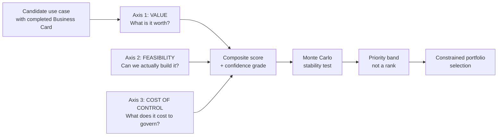

> Component of the [Use Case Prioritisation Model](../README.md) framework.

# The three axes, the composite formula, and enablers

## The three axes

Every candidate is scored on three axes. The third is the one most models omit.



### Axis 1 — Value (weight 40%)

| Criterion | Weight within axis | What is being scored |
|---|---|---|
| Risk-adjusted net benefit | 35% | From Business Card Block 4, after booking cap and optimism haircut |
| Strategic fit | 25% | Alignment to a named, current organisational objective |
| Non-monetisable / mission value | 20% | Tier 2 benefits with a stated baseline and target |
| Reusability | 20% | Assets this creates that later use cases consume (see Enablers and dependencies, below) |

**Rule:** the risk-adjusted net benefit score must use the capped and haircut figure from the Business Card, not the headline projection. A candidate with a Grade E baseline enters this axis at a structural disadvantage, which is correct — we do not know what it is worth.

### Axis 2 — Feasibility (weight 30%)

| Criterion | Weight within axis | What is being scored |
|---|---|---|
| Data readiness | 30% | Does the data exist, is it accessible, is its quality known |
| Technical complexity | 20% | Integration surface, novelty, dependency on unproven capability |
| Workflow change burden | 25% | How much the process and the people must change (see rule below) |
| Sponsorship and capacity | 25% | Named sponsor with authority, and the scarce people are actually available |

**Rule on workflow change burden:** this criterion is scored inversely to the temptation. A use case requiring no workflow change is easy — and, on the evidence, likely to deliver little. Score the burden honestly as a cost, but read a near-zero burden as a warning about Axis 1, not a strength. Overlaying AI on an unchanged process is the dominant failure pattern.

### Axis 3 — Cost of Control (weight 30%, scored as a penalty)

| Criterion | Weight within axis | What is being scored |
|---|---|---|
| Regulatory classification burden | 30% | Obligations arising from the risk tier under each applicable regime |
| Oversight operating cost | 25% | Recurring human review, escalation and appeal handling |
| Assurance and evidence burden | 25% | Documentation, testing, audit, impact assessment, monitoring |
| Residual risk exposure | 20% | Modelled negative risk delta not eliminated by controls |

This axis is subtracted, not added. See the composite formula below, and [cost-of-control-rationale.md](cost-of-control-rationale.md) for why it is a separate axis at all.

## Composite score

```
Value_axis       = Σ (criterion score × within-axis weight)      → 1..5
Feasibility_axis = Σ (criterion score × within-axis weight)      → 1..5
Control_axis     = Σ (criterion score × within-axis weight)      → 1..5

Priority Score = (0.40 × Value) + (0.30 × Feasibility) − (0.30 × Control) + 3.0

Range: 0.5 .. 5.5.  The +3.0 constant keeps the score positive and readable;
it is a presentation device and carries no meaning. State this on the card.
```

**Why Cost of Control is subtracted rather than folded into feasibility.** Governance overhead is not a feasibility problem — a high-risk use case is entirely feasible; it simply costs more to run lawfully and safely. Collapsing the two hides the trade-off the organisation most needs to see: whether the value survives the control cost. Keeping the axis separate also means the portfolio can be reported by control burden, which is what a risk committee will ask for.

## Enablers and dependencies

Enabling work — data platform, quality remediation, evaluation harness, control library, feature store — scores badly on Axis 1 because it has no standalone business value. A naive model defunds the foundations and then cannot explain why every subsequent use case is slow.

Three mechanisms:

**1. Reusability credit.** Already in Axis 1 (20% of the value axis). An enabler that unblocks named downstream candidates scores 4 or 5 there.

**2. Dependency-adjusted value.** An enabler inherits a share of the value of the candidates it unblocks:

```
Adjusted_Value(enabler) = Own_Value + (0.30 × Σ Value of blocked candidates
                                        that are themselves selected)
```

The 0.30 share is a convention, not a measurement — it exists to stop enablers scoring zero, and organisations should tune it. Only selected dependants count, otherwise every enabler can be justified by an unbounded wish list.

**3. Minimum enabler allocation.** A stated floor — suggested default 20% of portfolio capacity — reserved for enabling work regardless of score. This is a portfolio policy, not a scoring output. Without it, enablers lose every cycle to use cases with visible sponsors.

State dependencies explicitly as a directed graph. A candidate cannot be sequenced ahead of anything it depends on, whatever it scores.
