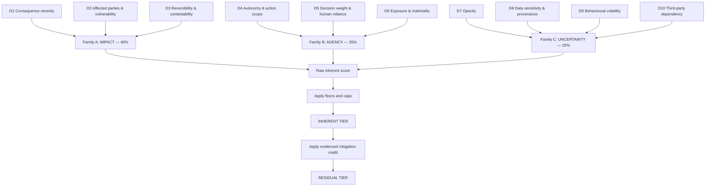

# Model Risk Tiering Scheme

Consequence-anchored tiering for every AI and model asset — including the ones current guidance has stepped back from.

## Purpose

The Model Risk Tiering Scheme assigns every AI and model asset in an organisation to a tier, and binds each tier to a defined, non-negotiable control set. It answers one question repeatedly and consistently: how much governance does this particular system need?

It is the routing layer of an AI management system. Without it, organisations do one of two things, both expensive: apply heavy controls uniformly until governance becomes the bottleneck everyone routes around, or apply controls case by case until the treatment of any given system depends on who happened to review it.

Outputs:

- An **Inherent Tier** — risk before controls. This is the tier of record.
- A **Residual Tier** — risk after evidenced controls. This modulates assurance effort only.
- A binding control obligation set attached to the tier.
- An explainable rule trail showing exactly why the tier was assigned.

## Why now: the SR 26-2 gap

This section is the framework's central positioning argument.

For fifteen years, the reference discipline for tiering model risk was the 2011 interagency supervisory guidance on model risk management — Federal Reserve SR 11-7 and OCC Bulletin 2011-12, adopted by the FDIC in 2017. Its core apparatus — a firm-wide model inventory, risk-based tiering by materiality, independent validation through effective challenge, ongoing monitoring — became the template far beyond banking.

On 17 April 2026, that guidance was superseded. The Federal Reserve, OCC and FDIC jointly issued revised guidance (SR 26-2 / OCC Bulletin 2026-13), which:

- Narrows the definition of "model" to a complex quantitative method, system or approach applying statistical, economic or financial theories to process input into quantitative estimates — explicitly excluding simple arithmetic calculations such as those found in spreadsheets, and deterministic rule-based processes and software with no statistical, economic or financial theory underpinning their design or use.
- Explicitly excludes generative and agentic AI models from scope, on the basis that these technologies are novel and rapidly evolving — while confirming that the guidance does apply to traditional statistical and quantitative models and to non-generative, non-agentic AI models.
- Introduces a $30 billion total asset applicability threshold, while noting it may still be relevant to smaller institutions with significant model risk exposure.
- Establishes that model purpose together with model exposure determines model materiality, where exposure refers to the significance of the model output to business decisions and can be quantitatively measured, and purpose is a qualitative consideration — with models developed to help meet regulatory requirements generally considered higher risk.
- Removes the prescribed annual validation cadence in favour of materiality-driven review.
- States explicitly that it does not set forth enforceable standards or prescriptive requirements, and that non-compliance will not itself result in supervisory criticism.

The agencies have signalled a forthcoming request for information addressing model risk management and, in particular, banks' use of AI including generative and agentic AI.

**Why this matters far beyond banking.** The revised guidance is careful on this point: systems outside its scope are not outside governance. It directs organisations to apply their broader risk management and governance practices to determine appropriate controls for anything not covered — including generative and agentic AI.

The practical consequence is a structural gap, and it is the gap this framework fills:

| Asset class | Covered by revised MRM guidance? | Covered by product/AI regulation? |
|---|---|---|
| Traditional statistical models | Yes | Sometimes, by application context |
| Non-generative, non-agentic AI | Yes | Sometimes, by application context |
| Generative AI | No — explicitly excluded | Sometimes, by application context |
| Agentic AI | No — explicitly excluded | Emerging and incomplete |
| Deterministic rule engines and spreadsheets driving consequential decisions | No — excluded by the narrowed definition | Generally not |

Three observations follow, and they justify the design of the ten dimensions below:

1. **The fastest-moving, least-understood systems now sit outside the most mature tiering discipline.** An organisation relying solely on an MRM inventory has a growing blind spot precisely where novelty is highest.
2. **Regulatory regimes tier by application context, not by technology.** A system's risk classification under a product-safety-style AI regime depends on what decision it touches, not what it is built from. An internal scheme must therefore be technology-agnostic and application-anchored, or it will not cross-walk.
3. **Narrowing the definition of "model" removes governance from tools that still drive consequential outcomes.** A deterministic rules engine that denies benefit applications is out of MRM scope and always was out of AI-specific scope — yet it is exactly the kind of system that generates administrative-law problems.

**The framework's position:** an internal tiering scheme must be broader than any single external regime, anchored on consequence rather than technology, and explicitly capable of tiering systems that no external regime currently claims. External classifications are then treated as floors the internal scheme must respect, not as the scheme itself.

## What gets tiered

Tier any system that influences a decision or takes an action with a consequence, irrespective of its technical construction. Specifically in scope:

- Statistical and machine learning models
- Generative AI systems, including those built on third-party foundation models
- Agentic systems that plan, invoke tools, or act
- Deterministic rule engines and scoring matrices driving consequential decisions
- Vendor and embedded AI features within procured software
- Material end-user computing artefacts where the output drives a consequential decision
- Composite systems and chains where the output of one feeds another

Explicitly out of scope: systems with no decision or action consequence — pure visualisation, unaggregated reporting, and internal experimentation in an isolated environment with no production data and no production output.

**The definitional rule: scope is determined by consequence, not by construction.** A spreadsheet that determines eligibility is in scope. A neural network that recommends canteen menus is, at most, Tier 1. Anchoring scope on technology is the error that produced the current gap; do not repeat it internally.

**On vendor systems:** procurement does not transfer accountability. A vendor system is tiered on the consequence of its use in your organisation, not on the vendor's own classification. Limited visibility into a proprietary component is a scoring input on the opacity dimension, not an exemption.

## The tier ladder

Five tiers. Tier 0 is a stop, not a tier.

| Tier | Name | Definition | Posture |
|---|---|---|---|
| T0 | Prohibited | The use falls within a practice prohibited under an applicable regime, or breaches a declared organisational red line | Do not build. Escalate. No mitigation pathway. |
| T1 | Limited | Minimal consequence; fully reversible; no personal data; internal advisory only | Register and monitor. Lightweight. |
| T2 | Moderate | Real but bounded consequence; reversible; human decides | Proportionate controls; standard assurance. |
| T3 | High | Material consequence to people, finances or obligations; limited reversibility, or meaningful autonomy | Full control set; independent review; formal approval. |
| T4 | Critical | Severe or irreversible consequence; safety-relevant; or high autonomy over consequential irreversible action | Maximum control set; executive approval; continuous assurance; standing kill switch. |

Tier 0 is deliberately included. A tiering scheme with no "no" is a routing scheme. The organisation must be able to record that a proposed use was refused, and why — that record is among the most valuable artefacts a governance function produces, and the one auditors most often find missing.

## The ten dimensions

Three families. Each dimension scores 1–5 with mandatory anchors.



| ID | Name | Family | Weight (within family) |
|---|---|---|---|
| D1 | Consequence severity | A · Impact (40%) | 40% |
| D2 | Affected parties and vulnerability | A · Impact (40%) | 30% |
| D3 | Reversibility and contestability | A · Impact (40%) | 30% |
| D4 | Autonomy and action scope | B · Agency (35%) | 40% |
| D5 | Decision weight and human reliance | B · Agency (35%) | 30% |
| D6 | Exposure and materiality | B · Agency (35%) | 30% |
| D7 | Opacity | C · Uncertainty (25%) | 25% |
| D8 | Data sensitivity and provenance | C · Uncertainty (25%) | 25% |
| D9 | Behavioural volatility | C · Uncertainty (25%) | 25% |
| D10 | Third-party dependency | C · Uncertainty (25%) | 25% |

Full anchor text for all ten dimensions, all five levels each, plus the explanatory notes on D4, D5 and D9, is in [reference/dimension-anchors.md](reference/dimension-anchors.md).

## Scoring

```
Family_A = 0.40·D1 + 0.30·D2 + 0.30·D3                    → 1..5
Family_B = 0.40·D4 + 0.30·D5 + 0.30·D6                    → 1..5
Family_C = 0.25·D7 + 0.25·D8 + 0.25·D9 + 0.25·D10         → 1..5

Raw = 0.40·Family_A + 0.35·Family_B + 0.25·Family_C        → 1..5

Inherent Risk Percentage = ((Raw − 1) / 4) × 100           → 0..100
```

Band mapping (aligned to the four-level structure used in Canada's Algorithmic Impact Assessment, adopted here for familiarity and cross-walk convenience):

| Percentage | Provisional tier |
|---|---|
| 0 – 25 | T1 Limited |
| 26 – 50 | T2 Moderate |
| 51 – 75 | T3 High |
| 76 – 100 | T4 Critical |

This provisional tier is not the answer. It is an input to the floor and cap rules below, which can only raise it (floors) or lower it within strict limits (caps). Weighted averaging alone is not an adequate basis for a risk classification, for the reason set out immediately below.

## Floors and caps

This is the second most important section in the framework, after the SR 26-2 gap it exists to close.

**The problem with additive scoring.** A weighted average lets a high score on one dimension be offset by low scores elsewhere. For risk classification this is not a rounding issue; it is a category error. A system that can cause irreversible harm to a vulnerable person does not become safe because it is transparent, cheap to run and built in-house. Compensation is invalid whenever a single dimension is independently sufficient to warrant control.

Floors and caps make the scheme non-compensatory where it must be, and proportionate everywhere else. They are the most important mechanism in the framework.

### Floor rules — these raise the tier and cannot be traded away

| ID | Condition | Effect |
|---|---|---|
| F0 | The use falls within a practice prohibited under an applicable regime, or breaches a declared organisational red line | T0 — refuse |
| F1 | Output determines or materially influences access to employment, credit, education, housing, healthcare, social benefits, or an essential public or private service | Minimum T3 |
| F2 | System can initiate an irreversible or externally visible action without per-instance human confirmation (D4 = 5) | Minimum T3 |
| F3 | Decision subjects include children or persons in a legally recognised position of vulnerability or dependence | Minimum T3 |
| F4 | System is classified as high-risk, or equivalent, under any applicable external regime | Minimum T3 |
| F5 | Failure could result in physical harm, or affects safety-relevant functions or critical infrastructure | Minimum T4 |
| F6 | Output determines a regulatory, statutory, prudential or capital outcome (D6 = 5) | Minimum T3 |
| F7 | Special-category data with unresolved lawful basis or undocumented provenance (D8 = 5) | Minimum T3 |
| F8 | D4 ≥ 4 and D9 ≥ 4 — meaningful autonomy combined with behaviour that changes without a release | Minimum T3 |
| F9 | D3 = 5 and D2 ≥ 4 — irreversible effect on a large or vulnerable population | Minimum T4 |
| F10 | No accountable named owner, or no identified process owner | Minimum T3 until remedied; may not enter production |

F10 is not a risk about the system. It is a risk about the organisation, and it is placed here deliberately: an unowned system cannot be governed at any tier, and the fastest way to get an owner named is to make the absence expensive.

F8 is the agentic gap rule. It captures precisely the combination that the revised MRM guidance does not reach: a system that acts, and whose behaviour drifts without anything a change-control process would notice.

### Cap rules — these lower the tier, and every condition must hold

| ID | All conditions required | Effect |
|---|---|---|
| C1 | No personal data · no external effect · fully reversible · human decides independently (D4 ≤ 2, D5 ≤ 2) · no regulatory purpose | Maximum T2 |
| C2 | Sandbox or evaluation environment · no production data · no production output · time-boxed with a declared expiry | Maximum T1, expires with the time box |

**Caps never override floors.** Where a cap and a floor conflict, the floor wins, always, without exception and without a discretionary override. This precedence rule must be enforced in code, not left to the assessor.

### Resolution order

Deterministic, in this exact sequence:

1. Compute the provisional tier from the score.
2. Evaluate F0. If it fires: T0, stop. No further processing.
3. Evaluate all remaining floors. Take the highest floor triggered.
4. Inherent Tier = max(provisional tier, highest floor).
5. Evaluate caps. Apply only if the resulting tier would remain at or above every triggered floor.
6. Record the complete trail: score, band, every rule evaluated, every rule fired, and the final assignment.

Step 6 is not optional. A tier without its rule trail is an assertion; a tier with one is a decision that can be reviewed, challenged and re-run.

Full detail, including the resolution-order rationale, is in [reference/floors-and-caps.md](reference/floors-and-caps.md).

## External regimes

The internal tier is the operational instrument. External classifications enter as floors (F4, F6, F0), never as replacements.

**Rationale.** External regimes are jurisdiction-specific, incomplete, and moving. An organisation operating across jurisdictions cannot run one scheme per regime without producing contradictory obligations for the same system. It maintains one internal scheme and maps outward.

Cross-walk properties to record per system, per applicable regime: regime name and version; whether the system is in scope; classification or tier under that regime; the organisation's role under it, where the regime distinguishes roles; resulting obligations; whether the obligation is already satisfied by the internal tier's control set, or requires an addition.

Two rules:

- The internal tier may exceed the external classification. It may never fall below it.
- Mitigation never lowers a regulatory classification. Controls reduce residual risk; they do not alter the legal character of the system. A system that is high-risk under an external regime carries those obligations regardless of how well controlled it is. Conflating the two is a serious and common error, and the code makes it structurally impossible — the residual tier is a separate field that has no effect on regime-derived obligations.

**Populating the cross-walk.** This framework defines the mechanism; the authoritative control mappings belong in the Cross-Regulation Control Library. Until that exists, the cross-walk table is populated per organisation from primary sources. Do not populate it with example regime mappings in this repository — a wrong article reference is worse than an empty field. See [template/cross-walk-worksheet.md](template/cross-walk-worksheet.md).

## Residual tier

The Inherent Tier is the tier of record. The Residual Tier exists to allow proportionate assurance effort where controls are genuinely in place and demonstrated.

Mitigation credit is earned, not claimed. Adopting the discipline used in Canada's AIA — where credit is given only for mitigation measures that are documented and in place, not planned or aspirational — this framework requires, for each claimed control: a named owner; documented evidence of operation, not of design; a test or assurance result dated within the tier's monitoring cadence; an identified failure mode it addresses, traceable to a specific dimension.

Rules: maximum reduction is one tier, never more, at any evidence level; never below any triggered floor; never from T4 (critical systems do not become high-risk systems because they are well managed — that is what "critical" means); never below T1. The residual tier modulates validation depth, monitoring cadence and reporting frequency only — it does not alter regulatory obligations, human oversight requirements, approval authority, or incident escalation path, which all follow the Inherent Tier. Residual credit lapses automatically if evidence is not refreshed within the cadence, returning the system to its Inherent Tier without a decision, review or grace period — this is automatic in the tooling, because a lapse that requires someone to notice it will not happen.

Full detail is in [reference/control-obligations.md](reference/control-obligations.md).

## Control obligations

This is the operative table — the point at which tiering becomes governance rather than labelling. Every cell is a binding obligation.

| Control domain | T1 Limited | T2 Moderate | T3 High | T4 Critical |
|---|---|---|---|---|
| Registration | Inventory entry | Inventory + business card | Full record + cross-walk | Full record + board-visible register |
| Approval authority | Process owner | Function head | Risk committee | Executive committee, with risk sign-off |
| Pre-deployment validation | Self-assessment | Documented internal review | Independent review by a party outside the build team | Independent review + external assurance or peer review |
| Effective challenge | Not required | Peer review | Independent, documented, with recorded resolution | Independent, documented, plus adversarial review |
| Testing | Functional | Functional + baseline performance | Performance, robustness, bias evaluation across relevant subgroups | All, plus adversarial and scenario testing across full decision paths |
| Human oversight | None required | Human decides; system advises | Human review with genuine capacity and authority to override | Human confirmation before consequential action; documented override rights and protections |
| Documentation | Purpose, owner, inputs | + method, data sources, limitations | + full technical file, assumptions, known failure modes, evaluation results | + decision rationale, residual risk acceptance, minuted approval |
| Monitoring | Availability | + performance against baseline | + drift, subgroup performance, override and exception rates | + continuous behavioural monitoring, real-time anomaly alerting |
| Monitoring cadence | Annual | Quarterly | Monthly | Continuous, with defined response times |
| Logging | Standard application logs | Decision logs | Decision logs with inputs and rationale, retained per policy | Full trajectory logs including tool calls and intermediate reasoning steps |
| Revalidation | On material change | Every 24 months or on trigger | Every 12 months or on trigger | Every 6 months or on trigger |
| Incident response | Standard IT process | Defined process with named owner | Defined playbook, escalation path, notification assessment | Playbook + rehearsed response + standing kill switch tested at defined intervals |
| Impact assessment | Not required | Screening | Full assessment | Full assessment + external or independent input |
| Contestability | Not applicable | Feedback route | Documented challenge route with defined response time | Formal appeal to a human with authority to reverse |
| Third-party assurance | Not required | Vendor attestation | Contractual assurance rights + evidence review | Right to audit + change notification + tested substitution plan |
| Decommissioning | Remove from inventory | Documented retirement | Retirement plan, data disposition, downstream dependency check | Full plan + transition arrangements + notification of affected parties |

On monitoring cadence: the revised MRM guidance removed the prescribed annual validation cadence in favour of materiality-driven review. This framework retains explicit cadences by tier for a practical reason: "risk-based frequency" without a stated default becomes "when someone remembers." The cadences above are the default; deviation is permitted where justified, documented and approved at the tier's approval authority.

## Composite systems

The revised MRM guidance identifies aggregate model risk arising from dependencies across models — shared data, shared assumptions, shared methodologies. Agentic architectures make this sharply worse: systems now invoke systems, at machine speed, without a human between them.

Five inheritance rules: downstream inheritance (a system inherits the maximum of its own and an upstream dependency's D7, D9 and D10 — you cannot be more certain than your inputs); consequence flows down, not up (a benign upstream component doesn't inherit a downstream system's Family A score, but does inherit its change-control obligations); the orchestrator rule (a system that invokes others is tiered on the union of all actions reachable through it — composition accumulates, it does not dilute); chain length (three or more autonomous invocations with no human checkpoint add +1 to D4, capped at 5); and common-mode dependency (a component shared by three or more T3+ systems is tiered at the maximum of its dependants, irrespective of its own standalone score).

Rule 5 is the one organisations discover late. A shared embedding pipeline scoring T1 on its own merits, on which six T3 systems depend, is a single point of failure with T3 consequence. Standalone tiering will never surface it. The dependency graph must be maintained, and it must be queried. See [reference/composite-systems.md](reference/composite-systems.md).

## Re-tiering triggers

Tiering is not an annual exercise. It is event-driven, with a periodic backstop.

Mandatory immediate re-tier on: change in the decision or action the system influences; expansion of scope (new population, jurisdiction, or use); change in autonomy or action scope; material change in volume, exposure or materiality; change to the underlying model, including a supplier-side update; change in data sources, categories or lawful basis; a new or amended regulatory obligation brought into scope; any incident, near-miss, or upheld challenge to an outcome; failure of a control on which mitigation credit was granted; change in a dependency's tier; loss of the named owner.

Periodic backstop: at each tier's revalidation cadence, regardless of whether a trigger fired.

The supplier-update trigger deserves emphasis. Where a system depends on a third-party model, the supplier's release schedule is now part of your change-control surface. If the contract does not provide change notification, D10 scores 4 or 5 and the framework will tier accordingly — which is the correct commercial signal to send.

## Using it

1. Complete the [assessment template](template/tiering-assessment.yaml) — the process owner scores it.
2. Second-party review — a second person, not the sponsor, scores independently or checks the scoring.
3. Run the tool to compute the tier and print the rule trail.
4. Record the tier, the rule trail, and the rule-set version in the [system register](template/system-register.csv).
5. Bind the resulting control obligations to delivery gates — registration, approval authority, validation, and everything else in the control obligations table.
6. Re-tier on trigger, forever — see re-tiering triggers above.

## The tool

`tool/tier.py` is a deterministic, fully explainable tiering engine — standard library Python only, no dependencies. It loads the rule set from `rules/`, evaluates an assessment YAML file, and prints the complete rule trail behind the tier it assigns.

```bash
python3 tool/tier.py examples/02-benefit-eligibility-triage.yaml --obligations
```

Policy lives in YAML; logic lives in Python; they do not mix — see [tool/README.md](tool/README.md) for why that separation is a governance property, not an engineering preference, and for the documented YAML subset the engine accepts.

## Worked examples

Four synthetic assessments, each demonstrating a distinct mechanism — proportionality at the low end, the flagship floor case, the agentic gap rule with a lapsed mitigation, and aggregate risk through a shared dependency. See [examples/worked-examples.md](examples/worked-examples.md).

Example 2 in particular is worth reading on its own: a deterministic rules engine that is invisible to both the revised MRM guidance (excluded by its narrowed model definition) and AI-specific regulation (it contains no AI) — yet decides who gets a benefit, and is correctly caught here by floors alone.

## Limitations

- Weights are a stated value judgement, not an empirical finding. 40/35/25 encodes a position: consequence matters most, agency next, uncertainty last. Defensible, not derived.
- Band boundaries are adopted for familiarity, following the four-level percentage structure used in Canada's AIA. They are not validated against outcome data, and no such validation set is publicly available.
- Scoring is judgement-based. The anchors constrain the judgement; they do not eliminate it. Two competent assessors will sometimes differ by a point, which is why second-party review is mandatory rather than advisory.
- The floors are the load-bearing element, and they are a policy choice. An organisation may reasonably add floors. Removing one should require the same authority as approving a T4 system.
- The scheme does not measure model quality. A well-built and a poorly-built system with identical consequence profiles tier identically. Quality is assessed by the validation activity the tier mandates — the tier decides how hard you look, not what you find.
- Aggregate risk handling is structural, not quantitative. The inheritance rules propagate tiers; they do not compute joint failure probability. Where that matters, a quantitative dependency analysis is needed in addition.
- Cross-walk mappings are deliberately unpopulated in this repository. The framework provides the mechanism; authoritative mappings require primary-source work per jurisdiction.
- External guidance is moving. The revised MRM guidance signals a forthcoming request for information on AI including generative and agentic AI. Any scheme in this space is provisional and should carry a review date.

## Relationship to other frameworks

Framework 01 (Business Card) supplies the intake record. Dimensions D1, D2, D3, D6 and D8 are largely answerable from a completed card. The card's human oversight field maps to D4/D5, and the internal-consistency check in the card is a cross-check on this scheme.

Framework 02 (Prioritisation) consumes the Inherent Tier as the primary input to its regulatory classification burden criterion on the Cost of Control axis. The tier is the objective anchor for what would otherwise be a subjective score.

Sequence: Business Card at intake → Tier assignment before build approval → Tier feeds prioritisation → Control obligations bind through delivery gates → Re-tier on trigger, forever.

## References

Cite in this exact form. Do not add entries.

- Board of Governors of the Federal Reserve System (2026). *SR 26-2: Revised Guidance on Model Risk Management*, 17 April 2026. Issued jointly with OCC Bulletin 2026-13 and a parallel FDIC statement; supersedes SR 11-7 (2011) and SR 21-8 (2021).
- Office of the Comptroller of the Currency (2026). *Bulletin 2026-13: Model Risk Management — Revised Guidance*.
- Board of Governors of the Federal Reserve System and OCC (2011). *SR 11-7 / OCC Bulletin 2011-12: Supervisory Guidance on Model Risk Management*. Superseded 17 April 2026.
- Treasury Board of Canada Secretariat. *Directive on Automated Decision-Making and Algorithmic Impact Assessment tool*. In force 1 April 2019; updated 25 April 2023.
- NIST (2023). *Artificial Intelligence Risk Management Framework (AI RMF 1.0)*. NIST.AI.100-1.
- ISO/IEC 42001:2023. *Information Technology — Artificial Intelligence — Management System*.
- ISO/IEC 23894:2023. *Information Technology — Artificial Intelligence — Guidance on Risk Management*.
- Huwyler, H. (2025). *The Risk-Adjusted Intelligence Dividend*. arXiv:2511.21975.
- Sullivan & Cromwell LLP (2026). *Federal Banking Agencies Issue Revised Guidance on Model Risk Management*, 29 April 2026.

## Version history

| Version | Date | Change |
|---|---|---|
| 1.0.0 | 2026-09-04 | Initial publication |
