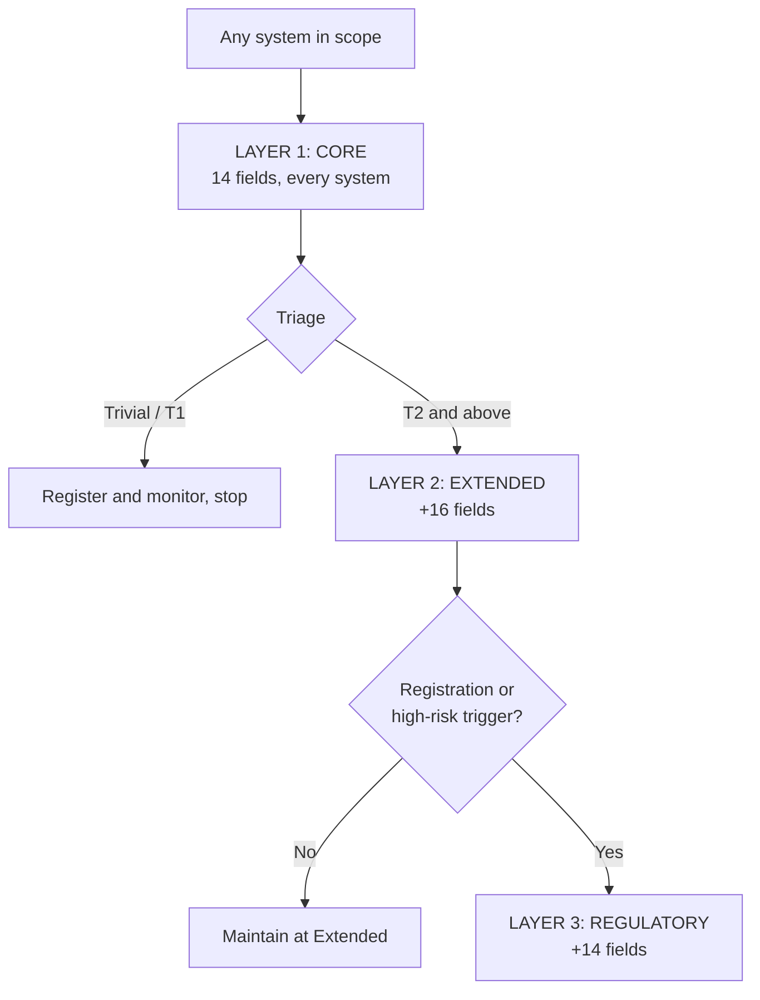

# AI System Register Schema

The foundational record: a schema people will actually populate, a discovery method that finds what nobody declared, and a 90-day plan to build it.

## Purpose

The AI System Register is the foundational artefact of an AI management system. It is the single, maintained record of every system in the organisation that uses AI or automation to make or support a decision, or to take an action.

Every other governance activity depends on it. You cannot tier what you have not enumerated, cannot prioritise a portfolio you cannot see, cannot assess impact on systems nobody registered, and cannot answer a regulator, auditor, customer or board question about "all your AI systems" without one.

It is also the most commonly failed artefact in AI governance, not because organisations do not build it, but because they build it once, for a deadline, and it is wrong within a quarter. This framework is designed around that failure mode: a minimum viable schema that people will actually populate, a discovery method that finds what nobody declared, and a maintenance mechanism that keeps it true without depending on goodwill.

**Design principle:** a register that is 80% complete and current beats one that is 100% complete and eighteen months old. Optimise for staying true, not for being comprehensive on day one.

## What a register is not

Clearing these up early prevents most of the scope arguments.

| It is not | Because |
|---|---|
| An IT asset inventory | Asset inventories track licences and endpoints. The register tracks decisions and actions, including ones made by a spreadsheet. |
| A model catalogue | Model catalogues are built for data scientists and track artefacts and versions. The register is built for accountability and tracks use in context. |
| A risk register | The risk register holds risks. The system register holds systems, each of which may generate several risks. They link; they do not merge. |
| A vendor list | Procurement records what was bought. It cannot see the AI feature switched on inside a product bought for something else. |
| A one-off compliance exercise | The deadline gets you to the register. It is not what the register is for. |

The register links to all of these. It replaces none of them.

## Scope

**The inclusion test.** Register any system where both of the following hold: it uses AI, machine learning, statistical inference, or automation to produce an output, and that output makes, supports, or triggers a decision or action with a consequence.

Scope is set by consequence, not by technology. A spreadsheet that determines eligibility is in scope. An LLM that suggests canteen menus is in scope but will classify as trivial. A dashboard nobody acts on is out.

**Deliberate over-inclusion rule.** On the first pass, register anything that might qualify. It is far cheaper to record a system and later mark it out of scope than to discover an unregistered one during an audit or an incident. Cast wide on the first pass, narrow on the second, and keep the out-of-scope entries with their reasoning, because "we considered it and here is why it is out" is a governance artefact in its own right.

Explicitly in scope, and routinely missed:

- AI features embedded in products bought for another purpose
- Spreadsheet models used for scoring, ranking or eligibility
- Deterministic rules engines driving consequential decisions
- Browser extensions and desktop AI assistants
- Local model runtimes on developer machines
- Agent frameworks, agents, MCP clients and MCP servers
- Free-tier and personal-account tools used for work
- Pilots, trials and proofs of concept touching real data
- Systems built by a team that does not consider itself technical

## The three-layer schema

The single biggest reason registers fail is that the field set is too heavy for the low-risk majority. This schema solves that with progressive disclosure: everything gets Core; only what matters gets more.



**Rule:** Layer 1 is mandatory for every system, without exception, and must be completable in under ten minutes by someone who is not a governance specialist. If it takes longer, the register will not be populated and everything downstream fails.

### Layer 1, Core (14 fields, every system)

| # | Field | Type | Definition | Example |
|---|---|---|---|---|
| 1 | system_id | string | Unique persistent identifier. Never reused. | AIR-0042 |
| 2 | name | string | What it is called internally | Claims triage scorer |
| 3 | description | text | One plain sentence on what it does | Scores inbound claims for fast-track eligibility |
| 4 | purpose | text | The decision or task it exists to perform | Route claims to fast-track or manual review |
| 5 | business_owner | person | Named individual accountable inside the organisation. Never a vendor, never a team. | A. Rahman, Head of Claims |
| 6 | technical_owner | person | Named individual accountable for it working | S. Okafor, Data Engineering |
| 7 | system_type | enum | See taxonomies below | predictive_model |
| 8 | provenance | enum | See taxonomies below | embedded_feature |
| 9 | decision_role | enum | See taxonomies below, the highest-value field in the register | supports |
| 10 | affects_people | enum | no / internal_staff / external_individuals | external_individuals |
| 11 | data_categories | multi | Plain-language categories consumed | claim history; personal identifiers |
| 12 | lifecycle_status | enum | See taxonomies below | in_use |
| 13 | discovery_source | enum | How this entry was found. See taxonomies below | declared_by_team |
| 14 | date_registered | date | First entry date | 2026-09-09 |

### Layer 2, Extended (16 further fields, T2 and above)

| # | Field | Type | Definition |
|---|---|---|---|
| 15 | risk_tier | enum | T0 to T4 from Framework 03 |
| 16 | tier_date | date | When the tier was assigned |
| 17 | tier_ruleset_version | string | Which rule-set version produced it |
| 18 | process_owner | person | Accountable for the business process it sits in |
| 19 | vendor | string | Supplier, or in-house. For embedded features, name the parent product too. |
| 20 | underlying_model | string | Model or family where known, including version |
| 21 | model_provenance | enum | in_house / open_weights / commercial_api / embedded_unknown |
| 22 | human_oversight_model | enum | See taxonomies below |
| 23 | autonomy_level | int 1 to 5 | Framework 03 dimension D4 |
| 24 | decision_weight | int 1 to 5 | Framework 03 dimension D5 |
| 25 | volume | string | Decisions or actions per period |
| 26 | systems_integrated | multi | Systems it reads from or writes to |
| 27 | depends_on | multi | system_id list, upstream dependencies |
| 28 | data_residency | string | Where data is processed and stored |
| 29 | monitoring_in_place | enum | none / availability / performance / drift_and_subgroup / continuous_behavioural |
| 30 | last_reviewed / next_review_due | date | Per tier cadence |

### Layer 3, Regulatory (14 further fields, where a trigger fires)

| # | Field | Definition |
|---|---|---|
| 31 | regimes_in_scope | Applicable regimes, per jurisdiction, populated locally |
| 32 | classification_per_regime | Classification under each |
| 33 | organisational_role | Role under each regime where the regime distinguishes roles |
| 34 | registration_required | Whether external registration is required |
| 35 | registration_reference | External registration or database reference number |
| 36 | registration_date | Date registered externally |
| 37 | lawful_basis | Lawful basis for processing personal data |
| 38 | impact_assessment_ref | Reference to the completed assessment |
| 39 | impact_assessment_date | Date completed |
| 40 | transparency_disclosure | Where the use is disclosed to affected people |
| 41 | contestability_route | How a person challenges an outcome |
| 42 | retention_and_logging | Log retention arrangement |
| 43 | conformity_evidence_ref | Reference to the conformity or assurance file |
| 44 | substantial_modification_log | Changes triggering re-registration |

**On Layer 3.** Registration obligations exist in several regimes. As one concrete example, under the EU AI Act, Article 49 requires providers, and in defined cases deployers, including public authority deployers, to register Annex III high-risk systems in the EU database established under Article 71 before placing on the market or putting into service, using the structured information set out in Annex VIII, and to update entries following a substantial modification. Certain information is publicly accessible. Registration is a pre-launch step, not a post-launch formality.

Other jurisdictions impose different triggers. As a second example, Australian Privacy Principles 1.7 to 1.9 require organisations to set out in their privacy policy the automated decisions that significantly affect people, from 10 December 2026, a disclosure obligation which cannot be drafted without a register that records the decision role of each system.

Do not pre-populate the regime mappings in this repository. The framework supplies the field structure; authoritative mappings require primary-source work per jurisdiction.

## Taxonomies

### System type

Traditional inventories were built for applications. AI estates contain three fundamentally different things, and the governance question differs for each.

| Category | Type value | Definition | Examples |
|---|---|---|---|
| Application | genai_assistant | Conversational or generative tool used by staff | Chat assistant, drafting tool |
| | embedded_saas_ai | AI feature inside a product bought for another purpose | CRM lead scoring, HR CV ranking |
| | predictive_model | Statistical or ML model producing a score, class or forecast | Churn model, claims triage, credit scorecard |
| | rules_engine | Deterministic logic driving a consequential decision | Eligibility matrix, pricing rules |
| | spreadsheet_model | Scoring or eligibility model in a spreadsheet | Grant scoring workbook |
| | browser_extension | AI running inside the browser session | Summariser, meeting notetaker |
| | coding_assistant | AI generating or reviewing code | Code completion, PR review bot |
| Infrastructure | model_api | Externally hosted model accessed by API | Foundation model endpoint |
| | local_model_runtime | Model running on local or self-hosted infrastructure | On-prem inference server, laptop runtime |
| | vector_store_rag | Retrieval infrastructure serving model context | Embedding store, RAG pipeline |
| | ml_platform | Training, serving or feature infrastructure | Feature store, model registry |
| Agentic | agent | System that plans and acts, invoking tools | Procurement agent, triage agent |
| | agent_framework | Orchestration layer for agents | Orchestrator, planner |
| | mcp_client | Component consuming tool servers | IDE agent with tool access |
| | mcp_server | Component exposing tools, data or actions to a model | Local server exposing a database |

**Why the agentic category is separate.** An assistant that drafts text and an agent that can write to a production database are not variants of the same thing, they are different governance problems. The inventory must capture what a system can do, not what it is built from. Local agentic components in particular, MCP servers on developer machines, local runtimes, agent frameworks, are the fastest-growing blind spot, and they appear in no traditional SaaS inventory.

### Provenance

Determines who you can ask questions of, and what assurance is available.

| Value | Definition | Governance implication |
|---|---|---|
| built_in_house | Developed internally | Full visibility; full accountability |
| bought_standalone | Procured as an AI product | Contractual assurance rights should exist, check they do |
| embedded_feature | AI inside a product bought for something else | Never separately procured, so never reviewed. Highest miss rate. |
| accessed_free_tier | Consumer or free-tier tool used for work | No contract, no data guarantees, often no visibility |
| open_weights_self_hosted | Open model run on own infrastructure | Full control; full responsibility for evaluation |
| agent_or_extension | Installed by an individual user | Often unmanaged; often privileged |

`embedded_feature` is the field that finds the most systems. The feature was switched on without a separate purchase, so it never reached a procurement gate, never got a security review, and never reached any register. Treat every embedded AI feature as in scope until ruled out.

### Decision role

The single highest-value field in the register. It determines regulatory exposure, drives Framework 03's D4 and D5 dimensions, and is the field most disclosure obligations turn on. It is also the one most often recorded optimistically.

| Value | Definition | Test |
|---|---|---|
| makes | The system decides. No person reviews before the outcome takes effect. | Does the outcome reach the person without a human seeing it? |
| supports_determinative | A person nominally reviews, but in practice defers | Is override technically available but rare, under throughput pressure, or without independent grounds to disagree? |
| supports_genuine | A person genuinely reviews and can overturn, with capacity and authority | Does the reviewer have time, information and standing to disagree, and do they measurably do so? |
| informs | One input among several; the person decides independently | Would the decision be made anyway, differently sourced? |
| no_decision | Produces no decision or action consequence | (none) |

The `supports_determinative` category is deliberate and is the most important design choice in the schema. Most registers offer only "makes" or "supports", and almost everything gets recorded as "supports" because a human is nominally in the loop. That collapses the distinction between real oversight and a rubber stamp, and rubber-stamped human-in-the-loop is the most common false control in AI governance.

**The evidence test.** If you cannot state the override rate for a system recorded as `supports_genuine`, you do not know that it is. An override rate near zero means the classification is `supports_determinative`, whatever the process document says. Measure it before claiming it.

### Lifecycle status

| Value | Definition | Register implication |
|---|---|---|
| proposed | Under consideration; not built | On the register from intake |
| in_development | Being built | Tier before build approval |
| in_trial | Pilot with real data or real users | Full obligations apply. A pilot touching real people is not exempt. |
| in_use | Live in production | Full obligations |
| suspended | Temporarily stopped | Retained; reason recorded |
| being_retired | Decommissioning in progress | Dependency check required before removal |
| retired | No longer in use | Retained, not deleted |
| out_of_scope | Assessed and excluded | Retained with reasoning |

Two rules: a register showing only live systems misses the one going to production next month; and retired entries are never deleted, because "what were we using in March" is a question that gets asked after an incident.

### Human oversight model

| Value | Definition |
|---|---|
| none | No human involvement in the loop |
| on_the_loop | Human monitors and can intervene, but does not approve individually |
| sampled_review | A defined sample is reviewed after the fact |
| in_the_loop | Human approves each consequential output before effect |
| human_decides | System advises only; the human makes the decision |

**Consistency rule.** This field must be coherent with `decision_role` and `autonomy_level`. A system recorded as `in_the_loop` oversight and `makes` decision role is internally contradictory, one of the two is wrong. The validator must flag this pairing.

### Discovery source

Record how each entry was found: `declared_by_team`, `amnesty`, `network_log`, `identity_oauth`, `endpoint_browser`, `saas_admin_sweep`, `expense_procurement`, `local_agentic_sweep`, `incident`, `audit`, `intake_process`.

This field is the register's own quality metric. If 95% of entries are `declared_by_team`, discovery has not run. A healthy mature register shows most new entries arriving through `intake_process`, because the front door is working, and continues to show a trickle from technical layers, because it always will.

## Worked classification examples

All examples below are illustrative constructions and describe no real system.

| # | System | system_type | provenance | decision_role | affects_people | Notes |
|---|---|---|---|---|---|---|
| 1 | CRM lead scoring switched on by Sales | embedded_saas_ai | embedded_feature | informs | external_individuals | Classic miss. In scope. Low tier, but registered. |
| 2 | HR platform ranking job applicants | embedded_saas_ai | embedded_feature | supports_determinative | external_individuals | Recruiters rarely go below the ranked fold. Override rate will confirm. |
| 3 | Spreadsheet scoring grant applications | spreadsheet_model | built_in_house | makes | external_individuals | Not "AI", not software, fully in scope. |
| 4 | Meeting notetaker extension | browser_extension | agent_or_extension | no_decision | internal_staff | No decision, but records confidential discussion. Registered for data reasons. |
| 5 | Claims triage model routing to fast-track | predictive_model | built_in_house | supports_genuine | external_individuals | Only if adjusters demonstrably override. Otherwise reclassify. |
| 6 | Eligibility rules engine for a benefit | rules_engine | built_in_house | makes | external_individuals | Deterministic, transparent, and among the highest-consequence entries. |
| 7 | Code completion in developer IDEs | coding_assistant | bought_standalone | informs | no | Low governance weight; matters for IP and code provenance. |
| 8 | Procurement agent issuing POs under a threshold | agent | built_in_house | makes | no | Acts autonomously. High autonomy despite no personal data. |
| 9 | MCP server on a developer laptop exposing a database | mcp_server | agent_or_extension | no_decision | no | No decision, significant exposure. Register it. |
| 10 | Free-tier chatbot used by marketing | genai_assistant | accessed_free_tier | informs | no | No contract. Data handling unknown. Register, then decide. |
| 11 | Shared embedding pipeline serving four systems | vector_store_rag | built_in_house | no_decision | no | Trivial standalone; critical as a dependency. |
| 12 | Chatbot answering customer policy questions | genai_assistant | bought_standalone | informs | external_individuals | Reclassify to makes the moment it starts confirming entitlements. |

**What these examples are designed to settle:**

- Entries 1, 2 and 12 are embedded or bought features nobody procured as "AI"
- Entries 3 and 6 contain no AI at all and are among the most consequential
- Entries 4, 9 and 11 make no decisions and still belong on the register, for data exposure and dependency reasons
- Entry 5 is the supports_genuine claim that must be evidenced, not assumed
- Entry 8 shows autonomy is a separate axis from personal data

## Finding shadow AI

The systems you already know about are the easy half. The register's credibility rests on the half nobody declared.

**Scale of the problem.** IBM's 2025 Cost of a Data Breach report found shadow AI was a factor in roughly one in five breaches, adding an average of USD 670,000 to breach cost, largely because most affected organisations had no AI governance policy. UpGuard's State of Shadow AI reporting puts unapproved AI tool use above 80% of workers.

### The five discovery layers

No single technique gives coverage. Fuse at least three.

| Layer | Mechanism | What it catches | What it misses | Effort |
|---|---|---|---|---|
| 1, Declared | Structured team survey; ask what tools they use to decide or sort anything about a person | Context, purpose, ownership, spreadsheets, intent | Anything people forget, hide, or do not think of as AI | Low cost, high time |
| 2, Network | DNS, egress, proxy, firewall, SWG logs for first-seen connections to model provider and AI domains | Breadth; server-side API calls; volume trends | Personal devices; encrypted tunnels; new providers not yet catalogued; what happened inside the session | Low, uses data you already hold |
| 3, Identity | OAuth grant enumeration across the workspace suite; SSO and audit logs filtered against an AI tool catalogue; service account audit; secrets scanning in code repositories for embedded API keys | Which account authorised what, and with which scopes; agent connections; API keys in code | Browser tools that need no enterprise identity; personal-account usage | Low to medium |
| 4, Endpoint and browser | Managed browser extension telemetry; endpoint agent inventory of AI desktop apps, local model runtimes, MCP servers and package installs | The broadest single layer, catches tools that bypass every other layer, including personal-account sign-ins and local agentic components | Unmanaged and personal devices | Medium; privacy consultation required |
| 5, Commercial | Expense and corporate card data; procurement and renewal records for the last 12 to 24 months; email scanning for sign-up confirmations and invoices | Paid subscriptions bought outside procurement; embedded features arriving via renewal | Free tiers; anything not paid for | Low |

**Correlation beats any single source.** Network logs alone miss most of it, because so much AI usage is browser-based and embedded in approved SaaS. Identity logs answer "which account authorised this" far better than raw network data. Expense data finds what nobody logged. Run at least three, then reconcile.

### Two mechanisms most programmes omit

**Approved-SaaS feature sweep.** Read the admin console of every significant SaaS platform and list the AI features available and which are enabled. AI capability arriving inside a renewal is the highest-volume source of unregistered systems, and it never passes a procurement gate because nothing was procured.

**Local agentic sweep.** Inventory MCP servers, local model runtimes, agent frameworks and IDE agents with tool access on developer machines. This is the fastest-growing blind spot and appears in no traditional inventory. Prioritise devices with privileged data access.

### The amnesty, a process mechanism, not a technical one

Technical discovery finds connections. It does not find purpose, ownership or the spreadsheet on someone's desktop. Run a time-boxed declaration amnesty alongside it:

- Announce a fixed window, four to six weeks
- State plainly that the objective is visibility, not enforcement, and that nothing declared in the window will be withdrawn or disciplined
- Provide a form that takes under five minutes and uses plain language, "anything that helps you decide, sort, rank, score, draft or answer", never the word "model"
- Make declaration the path of least resistance and provide a route to keep using the tool
- Publish what was found, in aggregate, and what happened next

Then close the loop: anything found by technical discovery after the amnesty closes that was not declared becomes a conversation with the team, not a sanction, but the register entry is created either way.

**On blocking.** Blocking traffic without addressing the underlying demand drives usage onto personal devices, removing all corporate visibility. A programme that reduces detected usage while demand is unchanged has made the problem invisible, not smaller. The register exists to see. Enforcement decisions come after, informed by the tier.

### The discovery_source field

This field is the register's own quality metric. If 95% of entries are `declared_by_team`, discovery has not run. A healthy mature register shows most new entries arriving through `intake_process`, because the front door is working, and continues to show a trickle from technical layers, because it always will.

## The 90-day playbook

A sequenced plan an AI Lead or CAIO can run directly.

### Days 1 to 15, Set up

| Step | Action | Output |
|---|---|---|
| 1 | Set the inclusion test and get it agreed by legal, risk and IT | One-page scope statement |
| 2 | Adopt the Layer 1 schema unchanged. Resist additions. | Register file created |
| 3 | Identify the registration triggers that apply in your jurisdictions | Layer 3 trigger list |
| 4 | Name a register owner, one person, not a committee | Named owner |
| 5 | Secure the data-access agreements needed for discovery layers 2 to 5 | Access confirmed |
| 6 | Brief the executive: the number will be embarrassing, and that is the point | Expectation set |

Step 6 matters more than it looks. The single most common way a register programme dies is an executive reacting badly to the first count. Pre-frame it: a high number means discovery worked. Zero shadow AI means the search failed.

### Days 16 to 45, Discover

| Step | Action | Output |
|---|---|---|
| 7 | Launch the amnesty. Announce it once, loudly, with the executive's name on it. | Declaration form live |
| 8 | Run the declared sweep team by team. Ask about tasks, not technology. | Layer 1 entries |
| 9 | Pull 30 to 90 days of network, identity, endpoint and expense signals | Raw candidate list |
| 10 | Run the approved-SaaS feature sweep across every significant platform | Embedded feature list |
| 11 | Run the local agentic sweep on developer estate | Agent and MCP inventory |
| 12 | Correlate all sources; de-duplicate; assign discovery_source | Consolidated candidate list |

Ask about tasks, not technology. "Do you use AI?" returns a low number. "What do you use to sort, score, rank, draft, summarise or decide anything?" returns the truth.

### Days 46 to 60, Classify

| Step | Action | Output |
|---|---|---|
| 13 | Complete Layer 1 for every candidate | Populated core register |
| 14 | Apply the taxonomies, using the classification examples to settle edge cases | Classified register |
| 15 | Challenge every supports_genuine: can you produce an override rate? | Corrected decision roles |
| 16 | Triage: which need Framework 03 tiering | Tiering queue |
| 17 | Tier the queue; record tier and rule-set version | Layer 2 populated |
| 18 | Mark out-of-scope entries with reasoning retained | Scope decisions recorded |

Step 15 is where the register earns its credibility. Expect a meaningful share of supports_genuine entries to have no measurable override rate. Reclassify them. This single step usually produces the most uncomfortable and most useful finding in the whole exercise.

### Days 61 to 75, Reconcile

| Step | Action | Output |
|---|---|---|
| 19 | Reconcile against public disclosures, privacy policy, customer commitments, contractual representations | Disclosure gap list |
| 20 | Reconcile against Layer 3 registration triggers | Registration gap list |
| 21 | Reconcile against the vendor and contract register: which systems have assurance rights? | Contract gap list |
| 22 | Build the dependency graph from depends_on; identify shared components with high-tier dependants | Critical dependency list |
| 23 | Escalate: anything unowned, anything T3+ without an impact assessment, anything undisclosed | Escalation pack |

Step 19 is the one that produces board attention, because it converts an inventory into a statement about the distance between what the organisation does and what it has said it does.

### Days 76 to 90, Operationalise

| Step | Action | Output |
|---|---|---|
| 24 | Bind registration to existing gates: procurement, change approval, project intake, vendor onboarding | Register entry becomes a gate condition |
| 25 | Set the re-registration triggers (Framework 03 section 1.12) | Trigger list live |
| 26 | Schedule ownership attestation, owners confirm their entries on the tier cadence | Attestation cycle |
| 27 | Set discovery to run continuously, not annually | Standing discovery |
| 28 | Publish register health metrics to the governance forum | First report |
| 29 | Set the review cadence and hand over to business as usual | Operating rhythm |

Step 24 is the difference between a register and a snapshot. A system should reach the register the way a new supplier reaches the contracts list, automatically, as a condition of proceeding, not through anyone's goodwill.

## Register health metrics

Report these, not the raw count. The count only tells you how hard you looked.

| Metric | Definition | Target | Reads as |
|---|---|---|---|
| Coverage confidence | Share of entries corroborated by 2 or more independent discovery sources | >60% | Do we believe the register? |
| Discovery mix | Share of new entries by discovery_source | Majority intake_process at maturity | Is the front door working? |
| Orphan rate | Entries with no named business owner | 0% | Nothing is ungoverned |
| Staleness | Share past next_review_due | <10% | Is it current? |
| Attestation rate | Owners confirming entries within cadence | >90% | Do owners engage? |
| Tier coverage | T2+ entries with a current tier | 100% | Is triage complete? |
| Undeclared discovery rate | New systems found by technical layers per quarter, post-amnesty | Declining, never zero | Is intake capturing new adoption? |
| Disclosure gap | Systems affecting people not covered by a public disclosure | 0 | The board-level number |

Undeclared discovery rate should never reach zero. A zero means discovery stopped running, not that shadow AI ended. Treat a sudden drop as a tooling failure until proven otherwise.

## Using it

1. Run the [90-day playbook](#the-90-day-playbook) above, or adapt it to your own timeline.
2. Complete [Layer 1 intake](template/layer1-intake-form.md) for every candidate system.
3. Run the [amnesty](template/amnesty-declaration-form.md) and the [team interview script](template/team-interview-script.md) alongside technical discovery.
4. Classify every entry against the taxonomies above, using the worked examples to settle edge cases.
5. Tier candidates that need it against Framework 03, and populate Layer 2.
6. Populate Layer 3 where a registration trigger fires, from primary sources, never invented.
7. Validate, monitor health, and query the dependency graph on a standing cadence, not once.

## The tool

`tool/register.py` validates a register CSV against the JSON schema and the declarative validation rules, computes the register health metrics, and walks the dependency graph, all standard library Python, no dependencies.

```bash
python3 tool/register.py validate examples/sample-register.csv
python3 tool/register.py health examples/sample-register.csv
python3 tool/register.py graph examples/sample-register.csv
```

Policy lives in JSON (`schema/`); logic lives in Python (`tool/`); they do not mix, see [tool/README.md](tool/README.md) for why that separation matters and for the two health metrics the tool is honest about not being able to compute from this schema alone.

## Worked example

A fifteen-entry synthetic register, the twelve worked classification examples plus three seeded validator failures, walked through end to end: validator output, health metrics, and the dependency graph surfacing a shared component that four higher-tier systems depend on. See [examples/worked-register.md](examples/worked-register.md).

## Limitations

- Discovery is never complete. Personal devices, unmanaged endpoints and novel providers remain invisible. The register is a best current view, not a guarantee, and should be described that way to auditors and boards.
- Network signals show connection, not content. A connection to an AI service does not reveal whether someone asked for a recipe or pasted a customer list. Discovery gives you an inventory; it does not give you exposure.
- decision_role is self-reported until override rates exist. The field's accuracy depends entirely on the willingness to measure. Untested, it will skew optimistic.
- The schema does not carry evaluation results, model performance, or technical documentation. It carries pointers to them. Attempting to hold the technical file in the register makes it unmaintainable.
- Layer 1 is deliberately thin, and will feel insufficient to specialists. That is the trade. A thicker Layer 1 produces a more informative register that nobody populates.
- Endpoint and browser telemetry carry employee-monitoring implications. Scope, consult and disclose them properly. Discovery that damages trust will not survive its first works council or privacy review.
- Regime mappings are deliberately unpopulated. Layer 3 supplies structure; authoritative mappings need primary-source work per jurisdiction.
- The metrics are proposed, not validated. The targets are reasoned starting points, not benchmarks derived from a dataset.

## Relationship to other frameworks

The register carries Framework 03's tier: `risk_tier`, `tier_date` and `tier_ruleset_version` are populated directly from a Model Risk Tiering assessment, and the register's own dependency graph implements the same composite-systems logic (Framework 03 section 1.11) at the estate level rather than one assessment at a time.

The register supplies Framework 02's candidate population: a use case cannot be prioritised until it exists as an entry, and the register is where every candidate, proposed or live, is enumerated.

Framework 01 intake creates entries: a completed Business Card is the trigger for a new register entry, not a parallel record kept separately.

**Sequence:** intake creates the entry, tiering populates Layer 2, registration triggers populate Layer 3, discovery finds what intake missed and feeds it back through the same front door.

## References

Cite in this exact form. Do not add entries.

- European Parliament and Council (2024). *Regulation (EU) 2024/1689 (Artificial Intelligence Act)*, Articles 49 and 71, Annex VIII.
- Office of the Australian Information Commissioner. *Australian Privacy Principles guidelines*, APP 1. Privacy Act 1988 (Cth).
- ISO/IEC 42001:2023. *Information Technology, Artificial Intelligence, Management System*.
- NIST (2023). *Artificial Intelligence Risk Management Framework (AI RMF 1.0)*. NIST.AI.100-1.
- IBM Security (2025). *Cost of a Data Breach Report 2025*.
- UpGuard. *State of Shadow AI*.
- CSIRO. *Responsible AI Pattern Catalogue*, including the transparency and impact assessment practice.
- Aicura (2026). *How to build an AI system register*. https://aicura.com.au/guides/build-an-ai-system-register/
- Board of Governors of the Federal Reserve System (2026). *SR 26-2: Revised Guidance on Model Risk Management*.

## Version history

| Version | Date | Change |
|---|---|---|
| 1.0.0 | 2026-09-09 | Initial publication |
